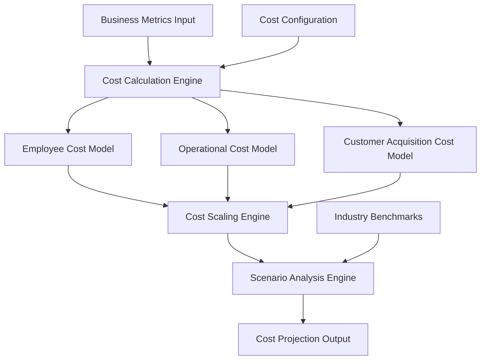

# Dynamic Cost Modeling System Design

## Overview

The Dynamic Cost Modeling System is a comprehensive financial modeling engine that calculates and projects operational costs, customer acquisition costs, and employee costs based on real business growth metrics. The system uses multiple scaling models (linear, step-function, and efficiency scaling) to provide accurate cost projections that automatically adjust as the company expands.

## Architecture

### High-Level Architecture



### Component Architecture

The system consists of several interconnected modules:

1. **Cost Calculation Engine**: Core engine that orchestrates all cost calculations
2. **Scaling Models**: Handles different scaling patterns (linear, step-function, efficiency)
3. **Cost Models**: Specialized calculators for different cost categories
4. **Scenario Engine**: Generates multiple projection scenarios
5. **Configuration Manager**: Manages cost assumptions and parameters

## Components and Interfaces

### 1. Cost Calculation Engine

**Purpose**: Central orchestrator for all cost calculations and projections

**Key Methods**:
- `calculateTotalCosts(businessMetrics, timeHorizon)`
- `updateCostProjections(newMetrics)`
- `getCostBreakdown(period, category)`

**Interfaces**:
```typescript
interface CostCalculationEngine {
  calculateEmployeeCosts(metrics: BusinessMetrics): EmployeeCostResult;
  calculateOperationalCosts(metrics: BusinessMetrics): OperationalCostResult;
  calculateCAC(metrics: BusinessMetrics): CACResult;
  projectCosts(scenarios: ScenarioConfig[]): CostProjection[];
}
```

### 2. Employee Cost Model

**Purpose**: Calculates staffing costs based on locations, acreage, and growth

**Key Features**:
- Headcount calculation based on acres per employee ratios
- Step-function scaling for management overhead
- Regional salary adjustments
- Benefits and tax calculations

**Scaling Logic**:
- Base employees: 1 per 50 acres managed
- Management layer: +1 manager per 5 employees
- Regional multipliers: Urban +15%, Rural -10%

### 3. Operational Cost Model

**Purpose**: Calculates facility, equipment, and operational expenses

**Key Categories**:
- **Facility Costs**: Lease/rent scaling with locations
- **Equipment Costs**: Purchase, financing, maintenance reserves
- **Vehicle Costs**: Fleet scaling with service areas
- **Utility Costs**: Usage-based scaling
- **Insurance Costs**: Coverage scaling with assets and locations
- **Compliance Costs**: Licensing and permits per location

**Scaling Patterns**:
- Fixed costs: Distributed across growing customer base
- Variable costs: Linear scaling with customers/locations
- Semi-variable: Step increases at capacity thresholds

### 4. Customer Acquisition Cost (CAC) Model

**Purpose**: Comprehensive CAC calculation including all acquisition channels

**Cost Components**:
- **Digital Marketing**: Google Ads, Facebook, SEO tools
- **Sales Team**: Salaries, commissions, tools, travel
- **Lead Generation**: Events, partnerships, referrals
- **Onboarding**: Setup and training costs per customer
- **Marketing Tech Stack**: CRM, automation, analytics
- **Conversion Optimization**: A/B testing, landing pages

**CAC Calculation**:
```
CAC = (Total Acquisition Costs) / (New Customers Acquired)
Blended CAC = Σ(Channel CAC × Channel Mix %)
```

### 5. Cost Scaling Engine

**Purpose**: Applies appropriate scaling models based on cost type and business stage

**Scaling Models**:

1. **Linear Scaling**: Direct proportional relationship
   - Variable costs (materials, commissions)
   - Formula: `Cost = Base Cost × Scale Factor`

2. **Step-Function Scaling**: Discrete jumps at thresholds
   - Management overhead, facility expansion
   - Formula: `Cost = Base Cost × ⌈Scale Factor / Threshold⌉`

3. **Efficiency Scaling**: Decreasing unit costs with volume
   - Technology costs, bulk purchasing
   - Formula: `Unit Cost = Base Cost × (Volume^-0.2)`

### 6. Scenario Analysis Engine

**Purpose**: Generates multiple cost projection scenarios

**Scenario Types**:
- **Conservative**: 75th percentile costs, slower growth
- **Realistic**: Median costs, expected growth
- **Aggressive**: 25th percentile costs, rapid growth

## Data Models

### Core Data Structures

```typescript
interface BusinessMetrics {
  totalCustomers: number;
  totalAcreage: number;
  numberOfLocations: number;
  monthlyRevenue: number;
  customerGrowthRate: number;
  averageCustomerSize: number;
  geographicRegions: Region[];
}

interface CostProjection {
  period: string;
  employeeCosts: EmployeeCostBreakdown;
  operationalCosts: OperationalCostBreakdown;
  acquisitionCosts: CACBreakdown;
  totalCosts: number;
  costPerCustomer: number;
  costPerAcre: number;
  scenario: ScenarioType;
}

interface EmployeeCostBreakdown {
  baseSalaries: number;
  benefits: number;
  payrollTaxes: number;
  managementOverhead: number;
  totalHeadcount: number;
  costPerEmployee: number;
}

interface OperationalCostBreakdown {
  facilityCosts: number;
  equipmentCosts: number;
  vehicleCosts: number;
  utilityCosts: number;
  insuranceCosts: number;
  complianceCosts: number;
  totalOperational: number;
}

interface CACBreakdown {
  digitalMarketing: number;
  salesTeam: number;
  leadGeneration: number;
  onboarding: number;
  marketingTech: number;
  totalCAC: number;
  cacByChannel: ChannelCAC[];
}
```

### Configuration Models

```typescript
interface CostConfiguration {
  employeeRatios: {
    acresPerEmployee: number;
    employeesPerManager: number;
    regionalMultipliers: RegionalMultiplier[];
  };
  operationalRates: {
    facilityLeasePerSqFt: number;
    equipmentFinancingRate: number;
    vehicleCostPerUnit: number;
    insuranceRatePerLocation: number;
  };
  acquisitionRates: {
    digitalMarketingCPL: number;
    salesPersonQuota: number;
    onboardingCostPerCustomer: number;
    conversionRates: ConversionFunnel;
  };
}
```

## Error Handling

### Validation Rules
- Business metrics must be positive numbers
- Growth rates must be within reasonable bounds (0-500%)
- Cost assumptions must be validated against industry benchmarks
- Scaling thresholds must be logically consistent

### Error Recovery
- Fallback to default assumptions if custom parameters are invalid
- Graceful degradation when external data sources are unavailable
- Clear error messages indicating which assumptions are being used

### Data Integrity
- Audit trail for all cost assumption changes
- Version control for cost models and parameters
- Validation against historical actuals where available

## Testing Strategy

### Unit Testing
- Individual cost model calculations
- Scaling algorithm accuracy
- Data validation and error handling
- Configuration parameter validation

### Integration Testing
- End-to-end cost projection workflows
- Scenario generation and comparison
- Real-time metric updates and recalculation
- Cross-model consistency validation

### Performance Testing
- Large-scale projection calculations
- Real-time update responsiveness
- Memory usage with complex scenarios
- Concurrent user access patterns

### Validation Testing
- Comparison with industry benchmarks
- Historical data validation where available
- Sensitivity analysis for key assumptions
- Cross-validation with existing financial models

## Implementation Considerations

### Performance Optimization
- Caching of frequently accessed calculations
- Incremental updates for metric changes
- Lazy loading of detailed breakdowns
- Efficient data structures for large projections

### Scalability
- Modular architecture for easy extension
- Configurable calculation engines
- Support for multiple business models
- API-first design for integration

### Maintainability
- Clear separation of concerns
- Comprehensive documentation
- Standardized interfaces
- Version-controlled cost assumptions

### Security
- Input validation and sanitization
- Secure storage of sensitive cost data
- Access controls for cost assumptions
- Audit logging for all changes