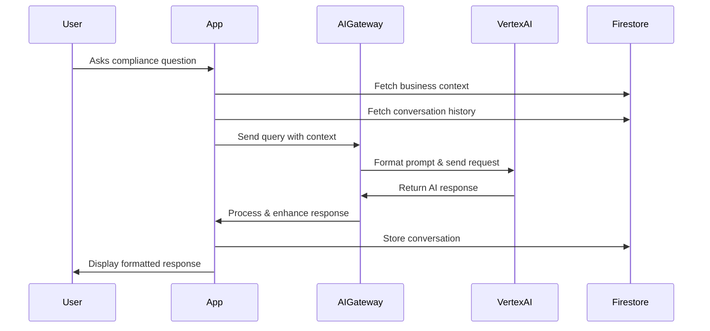
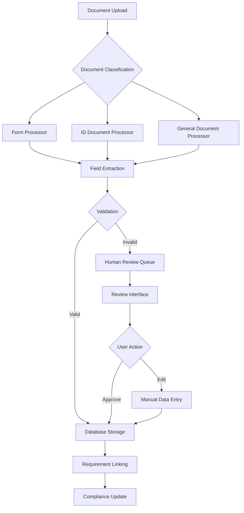

# Legal Compliance Software - AI Integration Specification

## Overview

This document outlines the detailed technical specifications for integrating Google's Vertex AI into the legal compliance software platform to deliver intelligent assistance, document analysis, and automated compliance guidance.

```
┌─────────────────────────────────────────────────────────────────┐
│                                                                 │
│                   Legal Compliance Platform                     │
│                                                                 │
├─────────┬─────────────┬───────────────────┬────────────────────┤
│         │             │                   │                    │
│ User    │ Document    │ Requirement       │ Filing             │
│ Flows   │ Management  │ Management        │ Automation         │
│         │             │                   │                    │
└─────────┴──────┬──────┴─────────┬─────────┴────────────────────┘
                 │                │
                 ▼                ▼
┌─────────────────────────────────────────────────────────────────┐
│                                                                 │
│                        AI Integration Layer                     │
│                                                                 │
├─────────────────┬───────────────────┬─────────────────────────┬─┘
│                 │                   │                         │
│ Conversational  │ Document          │ Compliance              │
│ Assistant       │ Intelligence      │ Intelligence            │
│                 │                   │                         │
└─────────────────┴───────────────────┴─────────────────────────┘
```

## AI Capabilities

### 1. Conversational Assistant

The AI-powered conversational assistant acts as an intelligent guide for compliance matters, helping users navigate complex regulatory requirements.

#### Technical Implementation

| Component | Specification |
|-----------|--------------|
| **Model Selection** | Primary: Gemini Pro<br>Fallback: PaLM Text |
| **Context Window** | Up to 32,000 tokens |
| **Input Processing** | Natural language processing with compliance-specific tuning |
| **Deployment Method** | Cloud Functions-based API Gateway to Vertex AI |
| **Response Time SLA** | Target: < 2 seconds for standard responses<br>< 5 seconds for complex queries |
| **Conversation Storage** | Firestore with hierarchical message structure |
| **Memory Management** | Sliding window of 20 messages with summarization for longer contexts |
| **Human Handoff** | Configurable thresholds for escalation to human support |

#### Key Functions

1. **Compliance Guidance**
   - Interpret and explain regulatory requirements in simple language
   - Provide step-by-step guidance for compliance procedures
   - Answer questions about deadlines, documentation, and filing processes
   - Generate custom compliance checklists based on business profile

2. **Status and Deadline Assistance**
   - Provide conversational access to compliance status
   - Remind about upcoming deadlines
   - Explain consequences of missed deadlines
   - Suggest prioritization of compliance activities

3. **Intelligent Filtering**
   - Help users find relevant requirements based on natural language queries
   - Filter documentation by conversational criteria
   - Assist with locating specific forms or templates

#### Prompt Engineering

```plaintext
You are LegalAssist, an AI compliance assistant for small businesses. 
Your goal is to provide clear, accurate guidance on regulatory requirements.

Business Context:
- Business: {business_name}
- Industry: {industry}
- Size: {employee_count} employees
- Locations: {locations}
- Entity Type: {entity_type}

Available Functions:
- searchRequirements(query) - Search for relevant requirements
- getRequirementDetails(id) - Get detailed information about a requirement
- checkComplianceStatus(requirementId) - Check compliance status
- generateDocument(templateId, data) - Generate compliance document
- scheduleReminder(requirementId, date) - Set compliance reminder

When answering:
1. Provide concise, practical guidance
2. Reference specific regulations when relevant
3. Avoid legally binding advice (you are not a lawyer)
4. Suggest document templates when appropriate
5. Offer to set reminders for deadlines

User query: {user_input}
```

#### Conversation Flow



### 2. Document Intelligence

The document intelligence capabilities enable automated processing, understanding, and validation of compliance-related documents.

#### Technical Implementation

| Component | Specification |
|-----------|--------------|
| **Core Models** | Document AI Processors + Gemini Vision |
| **File Format Support** | PDF, DOCX, JPG, PNG (OCR-enabled) |
| **Maximum File Size** | 20MB per document |
| **Processing Queue** | Cloud Tasks with prioritization |
| **Processing Time SLA** | < 30 seconds for standard documents<br>< 2 minutes for complex forms |
| **Output Formats** | Structured JSON, annotated PDF |
| **Confidence Scoring** | 0-100 scale for extracted fields with configurable thresholds |
| **Human Review** | Workflow for low-confidence extractions |

#### Key Functions

1. **Document Classification**
   - Automatically identify document types (e.g., license, permit, tax form)
   - Route to appropriate processor based on document type
   - Tag with relevant metadata (jurisdiction, expiration, etc.)

2. **Information Extraction**
   - Extract structured data from forms and documents
   - Identify key fields (dates, reference numbers, amounts)
   - Convert unstructured text to structured data
   - Map extracted data to the database schema

3. **Document Validation**
   - Verify document completeness
   - Check for errors or inconsistencies
   - Validate against known requirements
   - Flag issues for human review

4. **Compliance Gap Analysis**
   - Compare document content against requirements
   - Identify missing information or documents
   - Generate gap reports with recommendations
   - Prioritize remediation actions

#### Processing Pipeline



#### Document Type Processors

| Document Type | Processor | Extraction Fields | Confidence Threshold |
|---------------|-----------|-------------------|----------------------|
| Business License | License Processor | License #, Issue Date, Expiration Date, Jurisdiction, Business Name | 0.85 |
| Tax Forms | Tax Form Processor | Form Type, Tax Year, Filing Status, EIN, Payment Amount | 0.90 |
| Permits | Permit Processor | Permit Type, Issue Date, Expiration Date, Location, Conditions | 0.85 |
| Certificates | Certificate Processor | Certificate Type, Issue Date, Expiration Date, Issuing Authority | 0.85 |
| General Correspondence | General Document Processor | Sender, Date, Subject, Key Actions | 0.75 |

### 3. Compliance Intelligence

The compliance intelligence layer provides AI-powered insights, recommendations, and automation for the compliance management process.

#### Technical Implementation

| Component | Specification |
|-----------|--------------|
| **Primary Model** | Gemini Pro with compliance-specific tuning |
| **Analysis Types** | Predictive, Prescriptive, Diagnostic |
| **Update Frequency** | Daily batch processing + event-driven triggers |
| **Data Sources** | Business profile, compliance history, jurisdiction data, industry benchmarks |
| **Output Delivery** | Dashboard widgets, notifications, scheduled reports |
| **Confidence Levels** | Three tiers (High, Medium, Low) with visual indicators |

#### Key Functions

1. **Requirement Matching**
   - Analyze business profile to determine applicable requirements
   - Use AI to interpret complex eligibility criteria
   - Calculate compliance probability scores
   - Recommend jurisdiction-specific requirements

2. **Smart Questionnaires**
   - Generate dynamic questionnaires based on business profile
   - Adapt questions based on previous answers
   - Use branching logic to minimize unnecessary questions
   - Interpret free-text responses for compliance mapping

3. **Deadline Forecasting**
   - Predict upcoming compliance deadlines
   - Estimate time required for completion
   - Recommend optimal filing schedules
   - Identify deadline conflicts or bottlenecks

4. **Compliance Risk Assessment**
   - Analyze compliance patterns to identify risk areas
   - Score potential non-compliance impact
   - Recommend prioritization of compliance activities
   - Compare against industry benchmarks

#### AI-Powered Requirement Matching Algorithm

```python
def match_requirements(business_profile, all_requirements):
    """
    Pseudocode for AI-powered requirement matching
    """
    # Initialize results
    applicable_requirements = []
    maybe_applicable = []
    not_applicable = []
    
    # Extract business attributes
    industry = business_profile.primary_industry
    secondary_industries = business_profile.secondary_industries
    location_jurisdictions = get_jurisdictions_from_locations(business_profile.locations)
    employee_count = business_profile.employee_count
    revenue = business_profile.annual_revenue
    entity_type = business_profile.entity_type
    
    # Process each requirement
    for req in all_requirements:
        # Direct attribute matching
        industry_match = industry in req.industry_codes or any(ind in req.industry_codes for ind in secondary_industries)
        jurisdiction_match = req.jurisdiction_id in location_jurisdictions
        entity_match = entity_type in req.entity_types if req.entity_types else True
        size_match = is_within_range(employee_count, req.employee_thresholds) if req.employee_thresholds else True
        revenue_match = is_within_range(revenue, req.revenue_thresholds) if req.revenue_thresholds else True
        
        # Calculate base applicability score
        base_score = calculate_base_score(
            industry_match, jurisdiction_match, entity_match, size_match, revenue_match
        )
        
        # AI-enhanced analysis for complex criteria
        complex_text = f"""
        Requirement: {req.title}
        Description: {req.description}
        
        Business: {business_profile.name}
        Industry: {industry}, Secondary: {secondary_industries}
        Locations: {business_profile.locations}
        Size: {employee_count} employees
        Revenue: {revenue}
        Entity Type: {entity_type}
        """
        
        ai_score = call_vertex_ai_for_applicability_score(complex_text)
        
        # Combine direct matching with AI analysis
        final_score = 0.7 * base_score + 0.3 * ai_score
        
        # Categorize based on final score
        if final_score > 0.85:
            applicable_requirements.append((req, final_score))
        elif final_score > 0.40:
            maybe_applicable.append((req, final_score))
        else:
            not_applicable.append((req, final_score))
    
    return {
        'applicable': sorted(applicable_requirements, key=lambda x: x[1], reverse=True),
        'maybe_applicable': sorted(maybe_applicable, key=lambda x: x[1], reverse=True),
        'not_applicable': not_applicable
    }
```

## AI Integration Architecture

### System Design

```
┌─────────────────────────────────────────────────────────────────┐
│                         Client Applications                      │
└───────────────────────────────┬─────────────────────────────────┘
                                │
                                ▼
┌─────────────────────────────────────────────────────────────────┐
│                     Firebase Authentication                      │
└───────────────────────────────┬─────────────────────────────────┘
                                │
                                ▼
┌─────────────────────────────────────────────────────────────────┐
│                        API Gateway Layer                         │
└───────────┬───────────────────┬───────────────────┬─────────────┘
            │                   │                   │
            ▼                   ▼                   ▼
┌───────────────────┐ ┌───────────────────┐ ┌───────────────────┐
│                   │ │                   │ │                   │
│ Conversation      │ │ Document          │ │ Compliance        │
│ Service           │ │ Processing        │ │ Engine            │
│                   │ │ Service           │ │                   │
└─────────┬─────────┘ └─────────┬─────────┘ └─────────┬─────────┘
          │                     │                     │
          ▼                     ▼                     ▼
┌─────────────────────────────────────────────────────────────────┐
│                         AI Gateway Service                       │
└───────────────────────────────┬─────────────────────────────────┘
                                │
                                ▼
┌─────────────────────────────────────────────────────────────────┐
│                          Vertex AI APIs                          │
└─────────────────────────────────────────────────────────────────┘
```

### AI Gateway Service

The AI Gateway Service acts as a central intermediary between the application and Vertex AI, providing:

1. **Authentication and Security**
   - API key management
   - Rate limiting
   - Request validation
   - Output sanitization

2. **Context Management**
   - Business profile integration
   - Conversation history management
   - Document context injection
   - Token count optimization

3. **Model Orchestration**
   - Model selection logic
   - Prompt template management
   - Multi-model pipelines
   - Fallback handling

4. **Response Processing**
   - Output parsing and validation
   - Response enhancement
   - Error handling
   - Format conversion

#### Gateway Implementation

```typescript
// AI Gateway Service Pseudocode

interface AIGatewayRequest {
  businessId: string;
  userId: string;
  requestType: 'conversation' | 'document' | 'compliance';
  input: any;
  context?: any;
  modelPreference?: string;
}

interface AIGatewayResponse {
  result: any;
  modelUsed: string;
  confidence: number;
  processingTime: number;
  tokenUsage: {
    input: number;
    output: number;
  };
  metadata: any;
}

class AIGatewayService {
  async processRequest(request: AIGatewayRequest): Promise<AIGatewayResponse> {
    // Validate request
    this.validateRequest(request);
    
    // Check rate limits
    await this.checkRateLimits(request.businessId, request.requestType);
    
    // Enrich context
    const enrichedContext = await this.enrichContext(request);
    
    // Select appropriate model
    const selectedModel = this.selectModel(request.requestType, request.modelPreference);
    
    // Prepare prompt
    const prompt = await this.preparePrompt(request, enrichedContext);
    
    // Call Vertex AI
    const startTime = Date.now();
    const aiResponse = await this.callVertexAI(selectedModel, prompt);
    const processingTime = Date.now() - startTime;
    
    // Process and validate response
    const processedResponse = this.processResponse(aiResponse, request.requestType);
    
    // Log usage
    await this.logUsage(request, aiResponse, selectedModel, processingTime);
    
    // Return formatted response
    return {
      result: processedResponse,
      modelUsed: selectedModel,
      confidence: this.calculateConfidence(aiResponse),
      processingTime,
      tokenUsage: {
        input: this.countTokens(prompt),
        output: this.countTokens(aiResponse.text)
      },
      metadata: {
        timestamp: new Date().toISOString(),
        requestId: this.generateRequestId(),
        version: '1.0'
      }
    };
  }
  
  // Other methods...
}
```

### Model Selection and Fallback Strategy

| Primary Use Case | Primary Model | Fallback Models | Selection Criteria |
|------------------|---------------|-----------------|-------------------|
| Conversation | Gemini Pro | PaLM Text | Complexity, length, required capabilities |
| Document Analysis | Document AI + Gemini Vision | OCR + Gemini Pro | Document type, format, quality |
| Requirement Matching | Gemini Pro | Custom ML Model | Complexity, business attributes |
| Form Filling | Gemini Pro | Template Engine | Form complexity, automation level |

### AI Context Management

```typescript
// Context Management Pseudocode

interface BusinessContext {
  businessId: string;
  name: string;
  industry: string;
  size: number;
  locations: Location[];
  entityType: string;
  // Other business profile fields
}

interface UserContext {
  userId: string;
  name: string;
  role: string;
  preferences: any;
}

interface ConversationContext {
  conversationId: string;
  recentMessages: Message[];
  summarizedHistory?: string;
}

class ContextManager {
  async buildContext(request: AIGatewayRequest): Promise<any> {
    // Get business context
    const businessContext = await this.fetchBusinessContext(request.businessId);
    
    // Get user context
    const userContext = await this.fetchUserContext(request.userId);
    
    // Get request-specific context
    let specificContext = {};
    
    switch (request.requestType) {
      case 'conversation':
        specificContext = await this.buildConversationContext(request.input.conversationId);
        break;
      case 'document':
        specificContext = await this.buildDocumentContext(request.input.documentId);
        break;
      case 'compliance':
        specificContext = await this.buildComplianceContext(request.businessId);
        break;
    }
    
    // Combine contexts
    return {
      business: businessContext,
      user: userContext,
      specific: specificContext,
      system: {
        timestamp: new Date().toISOString(),
        version: '1.0'
      }
    };
  }
  
  private async buildConversationContext(conversationId: string): Promise<ConversationContext> {
    // Fetch recent messages
    const recentMessages = await this.fetchRecentMessages(conversationId, 10);
    
    // Check if conversation is long
    if (this.isLongConversation(conversationId)) {
      // Generate summary of older messages
      const olderMessages = await this.fetchOlderMessages(conversationId);
      const summary = await this.summarizeMessages(olderMessages);
      
      return {
        conversationId,
        recentMessages,
        summarizedHistory: summary
      };
    }
    
    return {
      conversationId,
      recentMessages
    };
  }
  
  // Other context building methods...
}
```

## Function Calling

AI capabilities will implement function calling to trigger actions within the system.

### Available Functions

| Function Name | Description | Parameters | Return Value |
|--------------|-------------|------------|--------------|
| `searchRequirements` | Search for requirements matching criteria | `query`: string, `filters`: object | Array of requirement objects |
| `getRequirementDetails` | Get detailed information about a requirement | `requirementId`: string | Requirement object |
| `checkComplianceStatus` | Check compliance status for a requirement | `requirementId`: string, `businessId`: string | Status object |
| `generateDocument` | Generate a document from a template | `templateId`: string, `data`: object | Document object |
| `scheduleReminder` | Schedule a compliance reminder | `requirementId`: string, `date`: string, `notes`: string | Reminder object |
| `addToCalendar` | Add a deadline to business calendar | `title`: string, `date`: string, `details`: object | Calendar event object |
| `startQuestionnaire` | Start a questionnaire session | `questionnaireId`: string | Questionnaire session object |
| `extractDocumentData` | Extract data from a document | `documentId`: string, `fields`: array | Extracted data object |

### Function Implementation

```typescript
// Function Calling Implementation Pseudocode

interface FunctionDefinition {
  name: string;
  description: string;
  parameters: any;
  required_parameters: string[];
}

class FunctionCallingManager {
  private registeredFunctions: Map<string, Function>;
  private functionDefinitions: FunctionDefinition[];
  
  constructor() {
    this.registeredFunctions = new Map();
    this.functionDefinitions = [];
    this.registerCoreFunctions();
  }
  
  private registerCoreFunctions() {
    // Register core functions
    this.registerFunction({
      name: 'searchRequirements',
      description: 'Search for requirements matching criteria',
      parameters: {
        query: { type: 'string', description: 'Search query' },
        filters: { type: 'object', description: 'Search filters' }
      },
      required_parameters: ['query']
    }, this.searchRequirements.bind(this));
    
    // Register other functions...
  }
  
  public registerFunction(definition: FunctionDefinition, implementation: Function) {
    this.functionDefinitions.push(definition);
    this.registeredFunctions.set(definition.name, implementation);
  }
  
  public getFunctionDefinitions(): FunctionDefinition[] {
    return this.functionDefinitions;
  }
  
  public async executeFunction(name: string, params: any): Promise<any> {
    if (!this.registeredFunctions.has(name)) {
      throw new Error(`Function ${name} not registered`);
    }
    
    const func = this.registeredFunctions.get(name);
    return await func(params);
  }
  
  public async processAIResponse(aiResponse: any): Promise<any> {
    // Check if AI response contains function calls
    if (aiResponse.functionCalls && aiResponse.functionCalls.length > 0) {
      const results = [];
      
      // Execute each function call
      for (const call of aiResponse.functionCalls) {
        try {
          const result = await this.executeFunction(call.name, call.parameters);
          results.push({
            functionName: call.name,
            result,
            success: true
          });
        } catch (error) {
          results.push({
            functionName: call.name,
            error: error.message,
            success: false
          });
        }
      }
      
      // Return original response with function results
      return {
        ...aiResponse,
        functionResults: results
      };
    }
    
    // No function calls, return original response
    return aiResponse;
  }
}
```

## Training and Fine-Tuning

### Domain-Specific Knowledge

1. **Compliance Knowledge Base**
   - Database of regulatory facts and definitions
   - Jurisdiction-specific information
   - Industry-specific compliance knowledge
   - Document type specifications

2. **Example Conversations**
   - Annotated compliance inquiries and responses
   - Common business scenarios
   - Edge cases with expert responses
   - Multi-turn conversation examples

### Evaluation Framework

| Metric | Description | Target | Measurement Method |
|--------|-------------|--------|-------------------|
| **Accuracy** | Correctness of information | > 95% | Expert review of random sample |
| **Helpfulness** | Value of response to user | > 4.5/5 | User feedback ratings |
| **Safety** | Avoidance of harmful advice | 100% | Safety evaluation suite |
| **Latency** | Response time | < 2s avg | Automated performance testing |
| **Completion Rate** | Tasks completed without human help | > 80% | Task completion tracking |

### Continuous Improvement

1. **Feedback Collection**
   - User ratings after each interaction
   - Thumbs up/down mechanism
   - Detailed feedback forms
   - System for expert corrections

2. **Regular Evaluation**
   - Monthly performance reviews
   - A/B testing of prompt improvements
   - Regular benchmark testing
   - Regression testing after updates

3. **Update Process**
   - Prompt engineering improvement cycle
   - Knowledge base expansion
   - Regular model version updates
   - Quarterly performance optimization

## Security and Privacy Considerations

### Data Protection

1. **Sensitive Information Handling**
   - PII detection and redaction
   - Confidential business information protection
   - Data minimization in AI requests
   - Secure storage of conversation history

2. **Model Isolation**
   - Use of dedicated Vertex AI project
   - No persistent data storage in model
   - Containerized AI services
   - Regular security audits

### Compliance Safeguards

1. **AI Output Controls**
   - Content filtering for inappropriate responses
   - Confidence thresholds for automated actions
   - Human review for high-risk operations
   - Clear attribution of AI-generated content

2. **Regulatory Compliance**
   - GDPR compliance for data processing
   - CCPA data rights implementation
   - Transparency in AI usage
   - Audit trails for AI decisions

### Risk Mitigation

| Risk | Mitigation Strategy |
|------|---------------------|
| Incorrect compliance advice | Confidence indicators, disclaimer notices, expert review threshold |
| Data leakage | Data minimization, PII redaction, secure transmission |
| Hallucinated information | Knowledge grounding, citation requirements, confidence scoring |
| System abuse | Rate limiting, anomaly detection, usage monitoring |
| Over-reliance on AI | Clear disclaimers, education on limitations, human escalation paths |

## Monitoring and Analytics

### Performance Metrics

1. **Usage Metrics**
   - Daily/weekly active users
   - Queries per user/business
   - Conversation length distribution
   - Function call distribution

2. **Quality Metrics**
   - Response accuracy (via feedback)
   - Document processing accuracy
   - User satisfaction scores
   - Task completion rates

3. **Technical Metrics**
   - Response latency
   - Error rates
   - Token usage
   - Model version performance comparison

### Logging Framework

```typescript
// AI Metrics Logging Pseudocode

interface AIMetricLog {
  timestamp: string;
  businessId: string;
  userId: string;
  requestType: string;
  modelUsed: string;
  inputTokens: number;
  outputTokens: number;
  latency: number;
  success: boolean;
  errorType?: string;
  userFeedback?: {
    rating: number;
    comments?: string;
  };
  metadata: any;
}

class AIMetricsLogger {
  async logInteraction(metrics: AIMetricLog): Promise<void> {
    // Store in Firestore
    await firestore.collection('ai_metrics').add(metrics);
    
    // Stream to BigQuery for analytics
    await this.streamToBigQuery(metrics);
    
    // Check for anomalies
    if (await this.detectAnomaly(metrics)) {
      await this.triggerAlert(metrics);
    }
  }
  
  private async detectAnomaly(metrics: AIMetricLog): Promise<boolean> {
    // Simple anomaly detection
    if (metrics.latency > 10000) return true; // Latency over 10s
    if (metrics.inputTokens > 10000) return true; // Unusually large input
    if (!metrics.success && metrics.errorType === 'critical') return true;
    
    // More sophisticated detection...
    return false;
  }
  
  // Other methods...
}
```

### Analytics Dashboard

The AI Analytics Dashboard will provide insights into:

1. **Usage Patterns**
   - Peak usage times
   - Most frequent query types
   - User engagement metrics
   - Business adoption rates

2. **Performance Insights**
   - Response quality by category
   - Document processing accuracy
   - Completion rates by task type
   - Latency distribution

3. **Cost Management**
   - Token usage trends
   - Cost per business
   - ROI calculations
   - Optimization opportunities

## Implementation Roadmap

### Phase 1: Foundation (Months 1-3)

1. **AI Gateway Setup**
   - Core infrastructure deployment
   - Authentication integration
   - Basic prompt templates
   - Initial logging framework

2. **Conversational Assistant MVP**
   - Basic compliance Q&A capabilities
   - Limited context integration
   - Fundamental safety guardrails
   - Simple feedback mechanism

### Phase 2: Core Functionality (Months 4-6)

1. **Document Intelligence**
   - Basic document classification
   - Form field extraction for common documents
   - Document validation for critical fields
   - Integration with document storage

2. **Enhanced Conversation**
   - Business context integration
   - Improved prompt engineering
   - Basic function calling
   - Expanded knowledge base

### Phase 3: Advanced Capabilities (Months 7-9)

1. **Compliance Intelligence**
   - Requirement matching algorithm
   - Smart questionnaire implementation
   - Risk assessment framework
   - Deadline forecasting

2. **Function Expansion**
   - Complete function calling implementation
   - Multi-step workflows
   - Enhanced document generation
   - Calendar and reminder integration

### Phase 4: Optimization (Months 10-12)

1. **Performance Enhancements**
   - Response time optimization
   - Caching strategy implementation
   - Model selection refinement
   - Cost optimization

2. **Analytics and Learning**
   - Comprehensive analytics dashboard
   - Feedback-driven improvements
   - A/B testing framework
   - Continuous learning implementation

## Success Criteria

| Category | Key Performance Indicator | Target |
|----------|---------------------------|--------|
| **User Adoption** | Active users engaging with AI | 80% of platform users |
| **Time Savings** | Reduction in compliance research time | 50% decrease |
| **Accuracy** | Correct compliance guidance | > 95% accuracy |
| **Efficiency** | Document processing automation rate | 70% of documents |
| **Satisfaction** | User satisfaction with AI capabilities | > 4.5/5 rating |
| **Cost Effectiveness** | ROI on AI implementation | 3x return within 12 months |

## Appendix

### Example Prompts

#### Compliance Guidance Prompt

```plaintext
You are a compliance assistant for small businesses. 
Your role is to provide helpful guidance on regulatory requirements without giving legal advice.

BUSINESS CONTEXT:
{business_context}

USER QUESTION:
{user_question}

CONVERSATION HISTORY:
{conversation_history}

AVAILABLE FUNCTIONS:
{function_definitions}

Instructions:
1. Provide clear, concise guidance related to the question.
2. If you need more information to provide a good answer, ask for it.
3. If appropriate, use available functions to retrieve information or perform actions.
4. Always clarify that you're providing general guidance, not legal advice.
5. If the question is outside your knowledge or capabilities, acknowledge limitations.
6. Be conversational but professional in tone.
7. Format your response for readability.
8. If citing specific regulations, be precise and accurate.
```

#### Document Analysis Prompt

```plaintext
SYSTEM: You are a document analysis assistant for a legal compliance system. 
Your task is to analyze the provided document and extract key information.

DOCUMENT CONTEXT:
Document Type: {document_type}
Business: {business_name}
File Name: {file_name}
OCR Content: {ocr_text}

EXTRACTION REQUIREMENTS:
Please extract the following information from the document:
{extraction_fields}

INSTRUCTIONS:
1. Extract each requested field with the highest possible accuracy.
2. For each field, provide the extracted value and a confidence score (0-100).
3. If a field cannot be found, indicate "NOT_FOUND" with an explanation.
4. If multiple possible values exist, list all candidates with reasoning.
5. For dates, standardize to YYYY-MM-DD format.
6. For monetary amounts, include the currency symbol/code.

RESPONSE FORMAT:
For each field, provide:
- Field name
- Extracted value
- Confidence score
- Location in document (page number, area)
- Any notes or uncertainties
```

### AI Function Definitions

```json
[
  {
    "name": "searchRequirements",
    "description": "Search for compliance requirements based on query and filters",
    "parameters": {
      "type": "object",
      "properties": {
        "query": {
          "type": "string",
          "description": "Natural language search query"
        },
        "filters": {
          "type": "object",
          "description": "Optional filters",
          "properties": {
            "jurisdiction": {
              "type": "string",
              "description": "Specific jurisdiction to search within"
            },
            "category": {
              "type": "string",
              "description": "Requirement category"
            },
            "deadline": {
              "type": "string",
              "description": "Deadline timeframe (e.g., 'next 30 days')"
            }
          }
        }
      },
      "required": ["query"]
    }
  },
  {
    "name": "getRequirementDetails",
    "description": "Get detailed information about a specific requirement",
    "parameters": {
      "type": "object",
      "properties": {
        "requirementId": {
          "type": "string",
          "description": "ID of the requirement"
        },
        "includeDocuments": {
          "type": "boolean",
          "description": "Whether to include associated document templates"
        }
      },
      "required": ["requirementId"]
    }
  },
  {
    "name": "generateDocument",
    "description": "Generate a document from a template with provided data",
    "parameters": {
      "type": "object",
      "properties": {
        "templateId": {
          "type": "string",
          "description": "ID of the document template"
        },
        "data": {
          "type": "object",
          "description": "Data to fill in the template"
        },
        "format": {
          "type": "string",
          "description": "Output format (PDF, DOCX)",
          "enum": ["PDF", "DOCX"]
        }
      },
      "required": ["templateId", "data"]
    }
  }
]
```

### Integration Test Cases

1. **Conversation Accuracy Test**
   - Test common compliance questions against known correct answers
   - Verify appropriate function calling for information retrieval
   - Confirm proper handling of ambiguous questions
   - Validate appropriate disclaimers in responses

2. **Document Processing Test**
   - Process sample documents of each supported type
   - Validate extraction accuracy against known values
   - Test handling of poor quality documents
   - Verify appropriate confidence scoring

3. **Function Calling Test**
   - Verify correct parameter extraction from user queries
   - Test error handling for invalid parameters
   - Confirm appropriate function selection
   - Validate response incorporation of function results 

## AI-Driven Onboarding Flow

The AI-driven onboarding flow is a critical component that powers the timeline-based compliance experience. It intelligently guides new users through a comprehensive questionnaire that identifies all necessary legal requirements for their business.

### Onboarding Questionnaire Architecture

```
┌───────────────────────────────────────────────────────────────┐
│                                                               │
│                 Onboarding AI Orchestrator                    │
│                                                               │
└───┬───────────────────┬────────────────────┬─────────────────┘
    │                   │                    │
    ▼                   ▼                    ▼
┌─────────────┐   ┌──────────────┐    ┌──────────────┐
│             │   │              │    │              │
│  Business   │   │  Location    │    │  Activity    │
│  Entity     │   │  Analyzer    │    │  Classifier  │
│  Profiler   │   │              │    │              │
│             │   │              │    │              │
└──────┬──────┘   └──────┬───────┘    └──────┬───────┘
       │                 │                   │
       └─────────────────┼───────────────────┘
                         │
                         ▼
                  ┌──────────────┐
                  │              │
                  │  Requirement │
                  │  Matcher     │
                  │              │
                  │              │
                  └──────┬───────┘
                         │
                         ▼
                  ┌──────────────┐
                  │              │
                  │  Timeline    │
                  │  Generator   │
                  │              │
                  │              │
                  └──────────────┘
```

### Questionnaire Logic

1. **Adaptive Question Flow**
   - Begin with core business information (entity type, industry, location)
   - Dynamically adjust questions based on previous answers
   - Skip irrelevant sections based on business profile
   - Branch into specialized sections for specific activities (e.g., food service, retail)
   - Progressively build a complete business profile

2. **Natural Language Interaction**
   - Conversational style questions for engaging experience
   - Plain language explanations of regulatory concepts
   - Follow-up clarification questions when needed
   - Help prompts available for every question
   - Example answers for guidance

3. **Initial Timeline Construction**
   - Real-time mapping of answers to requirement database
   - Progressive timeline visualization as questions are answered
   - Immediate feedback on critical requirements
   - Confidence scoring for requirement matching
   - Preview of upcoming obligations

### Technical Implementation

#### Vertex AI Prompt Design

**Base System Prompt for Onboarding**:
```
You are an expert business compliance assistant helping a new business owner through their onboarding process. Your goal is to identify all legal requirements applicable to their business and create a comprehensive compliance timeline.

Use a conversational, friendly tone while being thorough and methodical. Avoid legal jargon and explain concepts simply. Ask one question at a time, and use the information to determine the next most relevant question.

User Business Context:
{{accumulated_business_context}}

Previous Questions and Answers:
{{conversation_history}}

Current Compliance Requirements Identified:
{{identified_requirements}}

Your task is to:
1. Ask the most relevant next question to gather critical business information
2. Provide context on why this information matters for compliance
3. If you have enough information to identify a specific requirement, add it to the requirements list
4. Continue until you have comprehensively identified all potential requirements

Remember that the goal is to create a complete timeline of initial filing requirements and ongoing compliance obligations.
```

#### Question Categories and Logic Flow

**Entity Formation**:
- Business structure (sole proprietorship, LLC, corporation)
- Ownership details (single owner, partners, shareholders)
- State of formation
- Foreign qualification needs
- Operating agreements or bylaws status

**Location Analysis**:
- Primary business address
- Multiple locations analysis
- Home-based business determination
- Zoning compliance checks
- Building/space usage classification

**Business Activity Profiling**:
- Primary industry classification
- Specific business activities
- Regulated activities identification
- Professional licensing requirements
- Special certification needs

**Employee Considerations**:
- Current/planned employee count
- Contractor relationships
- Payroll processing plans
- Benefits offerings
- Workplace safety needs

**Financial Profile**:
- Estimated annual revenue
- Sales tax applicability
- Physical goods sales
- Services sales
- Interstate commerce

### Requirement Mapping Techniques

1. **Direct Mapping**
   - Clear threshold triggers (e.g., employee count > 50 = FMLA compliance)
   - Explicit activity requirements (e.g., food service = health permit)
   - Location-specific requirements (e.g., city business license)
   - Entity-type obligations (e.g., corporation = annual report)

2. **Inference-Based Mapping**
   - Combination factors (industry + location + size)
   - Activity pattern recognition
   - Similar business analysis
   - Regulatory pattern matching
   - Historical compliance data patterns

3. **Probability Scoring**
   - Confidence thresholds for requirement applicability
   - Weighted factor analysis
   - Multiple indicator correlation
   - Requirement clustering
   - Verification questions for uncertain matches

### Integration with Timeline System

1. **Timeline Population**
   - Immediate registration requirements
   - Sequenced initial filings with dependencies
   - Recurring compliance obligations
   - Deadline calculations based on formation date
   - Jurisdiction-specific timing rules

2. **Dynamic Timeline Updates**
   - Real-time requirement additions during onboarding
   - Confidence-based visualization (solid vs. suggested items)
   - Interactive confirmation of timeline items
   - Manual adjustment capabilities
   - Save and resume onboarding process

## Timeline-Focused AI Assistance

After onboarding, the AI assistant becomes timeline-focused, helping users understand and complete their compliance obligations through the centralized timeline interface.

### Timeline-Specific AI Features

1. **Task Guidance**
   - Step-by-step guidance for completing timeline items
   - Contextual help for specific requirements
   - Document preparation assistance
   - Form-filling guidance
   - Submission instructions

2. **Timeline Planning**
   - Workload balancing recommendations
   - Deadline management assistance
   - Resource allocation suggestions
   - Batch processing recommendations for similar filings
   - Critical path analysis for dependencies

3. **Timeline Exploration**
   - Natural language queries about timeline items
   - Timeline filtering via conversation
   - Deadline queries and reminders
   - Requirement explanation in plain language
   - Cost and time estimates for planning

### Conversational Interface for Timeline

**Example Timeline Interactions**:
```
User: "What's coming up in the next 30 days?"

AI: "You have 3 requirements due in the next 30 days:
     1. Quarterly Sales Tax Filing (Due May 20) - High Priority
     2. Annual Business License Renewal (Due May 31) - Critical
     3. Food Handler Certification Renewal (Due June 5) - Medium

     Would you like details on any of these items or help preparing for them?"

User: "Help me with the business license renewal"

AI: "For your Annual Business License Renewal due May 31st:

     Required documents:
     • Current business license (expires May 31)
     • Certificate of insurance (already on file)
     • Proof of tax compliance (needs to be requested)
     
     Estimated fee: $250
     Submission method: Online portal
     
     Would you like me to help you prepare these documents or explain the renewal process in more detail?"
```

**Proactive Timeline Assistance**:
```
AI: "I notice your Business License Renewal is due in 15 days, but you still need to request your Tax Compliance Certificate, which typically takes 5-7 business days to receive. Would you like to start that process now?"

User: "Yes, how do I do that?"

AI: "To request your Tax Compliance Certificate:
     1. Log in to the state tax portal (link provided below)
     2. Go to 'Tax Clearance' section
     3. Select 'Business License Renewal' as the reason
     4. Pay the $15 processing fee
     5. You'll receive the certificate by email in 5-7 business days
     
     Would you like me to save this as a task with a reminder for tomorrow?"
```

### Technical Implementation

1. **Context-Aware Timeline Assistance**
   - Timeline state tracking
   - Upcoming deadline awareness
   - User progress monitoring
   - Document completion status
   - Historical interaction patterns

2. **Timeline Data Sources**
   - Current business profile
   - Requirement database with detailed steps
   - Deadline calculation engine
   - Document preparation guides
   - Filing history and patterns

3. **Timeline Conversation Management**
   - Topic classification for timeline queries
   - Intent recognition for timeline actions
   - Timeline-specific entity extraction
   - Contextual memory for multi-turn conversations
   - Conversation state management for complex processes 