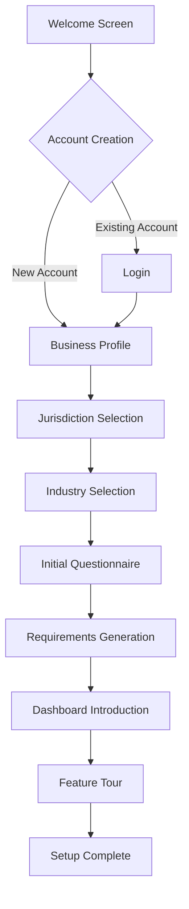
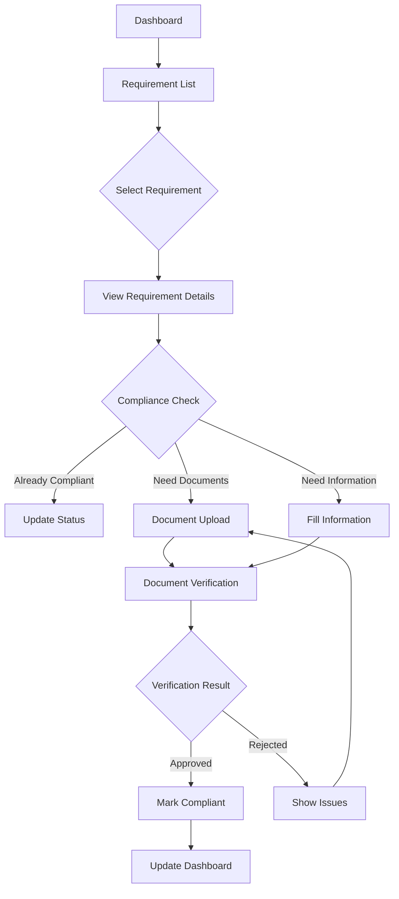
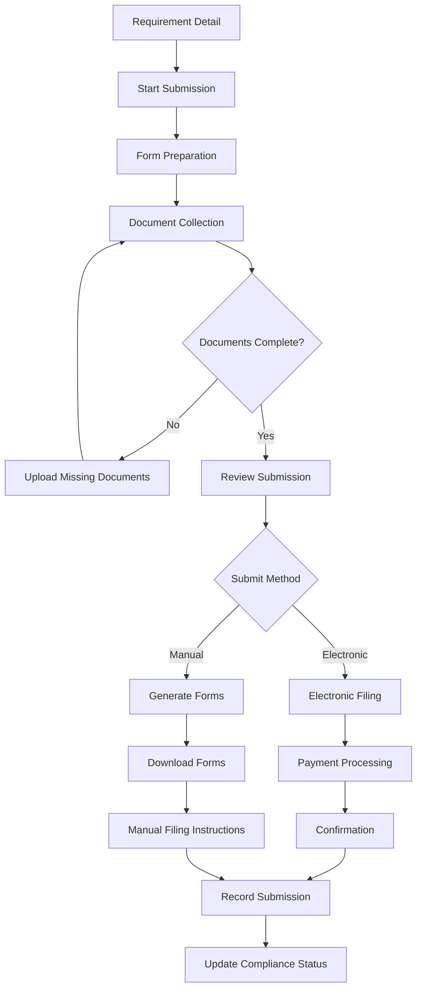

# Legal Compliance Software - UI/UX Design Specification

## Overview

This document outlines the design principles, user interface components, and interaction patterns for the legal compliance software platform. The design prioritizes simplicity, clarity, and efficiency to help small business users navigate complex compliance requirements without specialized legal knowledge.

## Design Principles

### 1. Clarity Over Complexity

The UI prioritizes clear communication over technical complexity. Legal and regulatory concepts are presented in plain language with visual aids to enhance understanding.

### 2. Progressive Disclosure

Information is presented in layers, revealing details progressively as needed. This prevents overwhelming users with too much information at once while ensuring comprehensive guidance remains accessible.

### 3. Contextual Assistance

Help and guidance are provided within the context of user tasks rather than in separate documentation. Interactive tooltips, embedded explanations, and just-in-time assistance guide users through complex processes.

### 4. Confidence-Building Design

The interface clearly communicates compliance status and next steps to build user confidence. Visual indicators show progress and completion status for compliance tasks.

### 5. Accessibility First

The application follows WCAG 2.1 AA standards to ensure accessibility for all users, including those with disabilities. Proper contrast ratios, keyboard navigation, screen reader compatibility, and responsive design are implemented throughout.

## Visual Design System

### Color Palette

```
Primary Colors:
- Primary Blue: #1A73E8 (Buttons, links, primary actions)
- Secondary Teal: #00A3A1 (Accents, secondary actions)

Status Colors:
- Success Green: #36B37E (Completed tasks, compliance)
- Warning Amber: #FFAB00 (Approaching deadlines, attention needed)
- Error Red: #FF5630 (Overdue items, non-compliance)
- Neutral Gray: #6B778C (Inactive items, disabled states)

Background Colors:
- Light Background: #F5F7FA (Main background)
- Card Background: #FFFFFF (Component backgrounds)
- Subtle Background: #EDF2F7 (Secondary backgrounds, hover states)

Text Colors:
- Primary Text: #172B4D (Headings, important text)
- Secondary Text: #505F79 (Body text)
- Tertiary Text: #8993A4 (Helper text, captions)
```

### Typography

```
Font Family: Inter (Primary), Roboto Mono (Code/Numbers)

Headings:
- H1: Inter 28px/32px Bold (#172B4D)
- H2: Inter 24px/28px Bold (#172B4D)
- H3: Inter 20px/24px Bold (#172B4D)
- H4: Inter 18px/22px Bold (#172B4D)
- H5: Inter 16px/20px Bold (#172B4D)
- H6: Inter 14px/18px Bold (#172B4D)

Body Text:
- Body Large: Inter 16px/24px Regular (#505F79)
- Body Default: Inter 14px/20px Regular (#505F79)
- Body Small: Inter 13px/18px Regular (#505F79)

Supporting Text:
- Caption: Inter 12px/16px Regular (#8993A4)
- Overline: Inter 12px/16px Medium, all caps (#8993A4)
```

### Iconography

```
Icon System: Material Design Icons
Custom Icons: Legal/compliance-specific iconography
Icon Sizes: 16px, 20px, 24px, 32px
```

### Spacing System

```
Base Unit: 4px

Space Scale:
- xs: 4px
- sm: 8px
- md: 16px
- lg: 24px
- xl: 32px
- xxl: 48px
- xxxl: 64px
```

### Component Library

#### Button System

```
Primary Button:
- Background: #1A73E8
- Text: White
- Hover: #1557B0
- Active: #174EA6
- Disabled: #DFE1E6 (Background), #A5ADBA (Text)

Secondary Button:
- Background: Transparent
- Border: 1px solid #DFE1E6
- Text: #1A73E8
- Hover: #F4F5F7 (Background)
- Active: #EBECF0 (Background)
- Disabled: #F4F5F7 (Background), #A5ADBA (Text)

Tertiary Button:
- Background: Transparent
- Text: #1A73E8
- Hover: #F4F5F7 (Background)
- Active: #EBECF0 (Background)
- Disabled: #A5ADBA (Text)

Button Sizes:
- Small: 28px height, 12px text
- Medium: 36px height, 14px text
- Large: 44px height, 16px text

Button States:
- Default
- Hover
- Active/Pressed
- Focus
- Disabled
- Loading
```

#### Form Elements

```
Text Input:
- Height: 36px
- Border: 1px solid #DFE1E6
- Border Radius: 4px
- Padding: 8px 12px
- Focus: Border 2px solid #1A73E8
- Error: Border 2px solid #FF5630
- Disabled: Background #F4F5F7, Text #A5ADBA

Dropdown:
- Height: 36px
- Similar styling to Text Input
- Dropdown Icon: Material chevron_down

Checkbox:
- Size: 16px x 16px
- Border: 1px solid #DFE1E6
- Border Radius: 2px
- Checked: Background #1A73E8, White checkmark
- Focus: 2px outline #1A73E8

Toggle:
- Height: 20px
- Width: 36px
- Border Radius: 10px
- Off: Gray background
- On: #1A73E8 background, white circle
```

#### Card System

```
Regular Card:
- Background: White
- Border Radius: 8px
- Border: None
- Shadow: 0 2px 6px rgba(0,0,0,0.08)
- Padding: 24px

Interactive Card:
- Same as Regular Card
- Hover: Shadow 0 4px 12px rgba(0,0,0,0.12)
- Active: Border 2px solid #1A73E8

Status Card:
- Border-left: 4px colored border (Green/Amber/Red)
- Background: White
- Other properties same as Regular Card
```

## Responsive Design Strategy

### Breakpoints

```
- Mobile: 320px - 767px
- Tablet: 768px - 1023px
- Desktop Small: 1024px - 1279px
- Desktop Large: 1280px+
```

### Layout Grid

```
- Base: 4-column grid (Mobile)
- Tablet: 8-column grid
- Desktop: 12-column grid
- Margins: 16px (Mobile), 24px (Tablet), 32px (Desktop)
- Gutters: 16px (Mobile), 24px (Tablet), 32px (Desktop)
```

### Responsive Patterns

```
- Stacking: Single-column layout on mobile
- Reflow: Multi-column content becomes single-column on smaller screens
- Priority Content: Most important content appears first on mobile
- Off-Canvas Navigation: Side nav becomes hidden on smaller screens
- Responsive Tables: Tables become cards or allow horizontal scrolling
```

## User Interface Components

### Navigation System

#### Top Navigation Bar

```
Components:
- Logo (left-aligned)
- Main navigation links (center)
- User profile & notifications (right-aligned)
- Search bar (expandable on smaller screens)

Behavior:
- Fixed position at top of viewport
- Condensed on scroll down
- Expanded on scroll up
```

#### Side Navigation

```
Components:
- Business profile selector
- Primary navigation categories
- Secondary navigation items
- Quick links section
- Help & support access

States:
- Expanded (default on desktop)
- Collapsed (icon-only on tablet)
- Hidden (on mobile, accessible via hamburger menu)
```

#### Breadcrumb Navigation

```
Components:
- Home icon
- Section links
- Current page (non-clickable)

Behavior:
- Truncated on smaller screens
- Shows current path in information hierarchy
```

### Dashboard Components

#### Compliance Status Card

```
Components:
- Overall compliance score (0-100%)
- Visual representation (circular progress)
- Status breakdown by category
- Quick action buttons

States:
- High compliance (green, 80-100%)
- Medium compliance (amber, 50-79%)
- Low compliance (red, 0-49%)
```

#### Upcoming Deadlines Widget

```
Components:
- Timeline visualization
- Deadline cards with:
  * Requirement name
  * Due date
  * Days remaining
  * Priority indicator
  * Quick-access action button

Sorting:
- By due date (default)
- By priority
- By completion status
```

#### Task Cards

```
Components:
- Title
- Description
- Due date
- Status indicator
- Progress indicator (if multi-step)
- Primary action button

States:
- Not started
- In progress
- Completed
- Overdue
- Not applicable
```

#### Notification Center

```
Components:
- Grouped notifications by type
- Timestamp
- Priority indicator
- Read/unread state
- Action buttons

Types:
- Deadline reminders
- Status changes
- New requirements
- Document expirations
- System notifications
```

### Compliance Management Interface

#### Requirement List

```
Components:
- Filterable, sortable table/list
- Requirement cards with:
  * Title
  * Category/jurisdiction
  * Due date
  * Status
  * Priority
  * Assigned to
  * Actions menu

Filters:
- By status
- By category
- By deadline
- By jurisdiction
- By assignee

View Options:
- List view (compact)
- Card view (detailed)
- Calendar view (deadline-focused)
```

#### Requirement Detail View

```
Sections:
- Header with status and actions
- Description and purpose
- Compliance instructions
- Required documents
- Deadline information
- History and audit trail
- Related requirements

Actions:
- Mark complete
- Upload documents
- Set reminders
- Assign to team member
- Add notes
```

#### Document Management

```
Components:
- Document browser with:
  * Document cards/rows
  * Preview thumbnails
  * Status indicators
  * Expiration warnings
  * Quick actions

Actions:
- Upload new document
- Replace existing document
- Download
- Share
- Archive

Organization:
- By requirement
- By document type
- By expiration date
- By upload date
```

### Smart Questionnaire Interface

#### Questionnaire Flow

```
Components:
- Progress indicator
- Question card with:
  * Question text
  * Help text/tooltip
  * Input field(s)
  * Previous/Next buttons
  * Save progress button

Input Types:
- Single select
- Multi-select
- Text input
- Number input
- Date picker
- File upload
- Yes/No toggle

Behavior:
- Conditional questions
- Branching logic
- Validation
- Auto-save
```

#### Results Summary

```
Components:
- Completion status
- Key findings
- Generated requirements
- Recommended actions
- Download/share options

Visualization:
- Compliance heat map
- Requirement summary charts
- Status indicators
```

### AI Assistant Interface

#### Conversation Interface

```
Components:
- Message thread with:
  * User messages (right-aligned)
  * Assistant responses (left-aligned)
  * Timestamp
  * Read indicators
- Input field with:
  * Text area
  * Send button
  * Attachment option
  * Suggestion chips

Features:
- Rich text formatting in responses
- Embedded actionable links
- Document previews
- Contextual suggestion chips
```

#### Document Analysis

```
Components:
- Document viewer with:
  * Page navigation
  * Zoom controls
  * Annotation overlay
- Analysis panel with:
  * Extracted information
  * Confidence scores
  * Validation results
  * Action recommendations

Visualization:
- Highlighted fields
- Error indicators
- Confidence indicators
```

## Interaction Patterns

### Onboarding Flow

```
Stages:
1. Welcome & Account Creation
2. Business Profile Setup
3. Jurisdiction Selection
4. Initial Compliance Assessment
5. Dashboard Introduction
6. Feature Tour
7. Personalization Options
8. Success Confirmation

Design Elements:
- Progress indicator
- Contextual help
- Visual confirmations
- Skip options where appropriate
```

### Compliance Workflows

#### New Requirement Flow

```
Stages:
1. Notification/Discovery
2. Review Details
3. Applicability Assessment
4. Task Assignment
5. Document Collection
6. Submission Preparation
7. Filing
8. Confirmation/Record

Features:
- Status tracking
- Email/notification reminders
- Deadline forecasting
- Calendar integration
```

#### Renewal Workflow

```
Stages:
1. Advance Notification
2. Document Retrieval
3. Information Update
4. Renewal Submission
5. Payment Processing
6. Confirmation
7. Record Update

Features:
- Prefilled forms from previous submissions
- Automatic document expiration tracking
- Change highlighting from previous submissions
```

### Navigation & Discovery Patterns

#### Search Functionality

```
Features:
- Global search across all content
- Predictive search suggestions
- Recent searches
- Filtered results by category
- Natural language query support

Result Types:
- Requirements
- Documents
- Conversations
- Knowledge base articles
```

#### Filtering & Sorting

```
Filter Types:
- Status filters
- Category filters
- Date range filters
- Tag filters
- Location filters

Sorting Options:
- By deadline (nearest first)
- By status (overdue first)
- By importance (highest first)
- By name (alphabetical)
- By date added (newest first)
```

#### Notifications System

```
Notification Delivery:
- In-app notifications
- Email notifications
- Mobile push notifications (if applicable)
- Calendar events

Priority Levels:
- Urgent (red, immediate attention)
- Important (amber, soon attention)
- Informational (blue, for awareness)

Customization:
- By notification type
- By delivery method
- By frequency
```

## Mobile Experience

### Mobile-Specific Components

#### Bottom Navigation

```
Components:
- Icon-based navigation
- 4-5 primary destinations
- Active state indicator
- Optional labels
```

#### Floating Action Button (FAB)

```
Features:
- Primary action for current screen
- Expandable for multiple actions
- Persistent across scrolling
```

#### Pull-to-Refresh

```
Behavior:
- Visual indicator on pull
- Loading animation
- Success/failure feedback
```

### Mobile Adaptations

#### Dashboard

```
Adaptations:
- Stacked card layout
- Swipeable widgets
- Condensed status indicators
- Progressive disclosure of details
```

#### Requirement Management

```
Adaptations:
- Card-based list view
- Limited filtering options
- Tap-to-expand details
- Context-aware actions
```

#### Document Handling

```
Adaptations:
- Native file picker integration
- Camera integration for scanning
- Optimized document preview
- Offline access to critical documents
```

## Animation & Microinteractions

### Animation Principles

```
Characteristics:
- Subtle and purposeful
- Quick (150-300ms)
- Easing functions for natural feel
- Provides feedback, not decoration
```

### Key Microinteractions

```
Examples:
- Status changes with color transitions
- Progress indicators with smooth animations
- Form validation feedback
- Success/error state transitions
- Loading state indicators
- Pull-to-refresh animations
```

### Motion System

```
Transition Types:
- Fade: Opacity changes (100-200ms)
- Slide: Position changes (200-300ms)
- Scale: Size changes (150-250ms)
- Color: State changes (100-200ms)

Easing Functions:
- Standard: Cubic-bezier(0.4, 0.0, 0.2, 1)
- Accelerate: Cubic-bezier(0.4, 0.0, 1.0, 1.0)
- Decelerate: Cubic-bezier(0.0, 0.0, 0.2, 1.0)
```

## User Flows

### Business Onboarding Flow



### Compliance Check Flow



### Document Submission Flow



## Accessibility Considerations

### Keyboard Navigation

```
Features:
- Logical tab order
- Visible focus indicators
- Keyboard shortcuts for power users
- Skip links for main content

Testing:
- Complete task flows using only keyboard
- Focus management within modals
- Alternative actions for hover states
```

### Screen Reader Support

```
Implementation:
- Semantic HTML structure
- ARIA labels where necessary
- Alternative text for images
- Meaningful link text
- Proper heading hierarchy
- Status announcements for dynamic content

Testing:
- NVDA, JAWS, and VoiceOver testing
- Task completion verification
```

### Color & Contrast

```
Standards:
- Minimum 4.5:1 contrast ratio for normal text
- Minimum 3:1 contrast ratio for large text
- Non-reliance on color alone for information
- High contrast mode support

Implementation:
- Multiple visual indicators for status (icons + color)
- Text alternatives for graphical information
- Customizable font sizes
```

## Loading & Error States

### Loading States

```
Types:
- Page loading (skeleton screens)
- Component loading (inline spinners)
- Action loading (button states)
- Background loading (subtle indicators)

Behavior:
- Show after 300ms delay to prevent flashing
- Indicate progress where possible
- Maintain layout stability (reserve space)
```

### Error States

```
Types:
- Form validation errors
- System errors
- Network errors
- Permission errors
- Empty states

Components:
- Clear error messaging
- Suggested resolution
- Retry options
- Alternative paths
- Contact support option
```

### Empty States

```
Components:
- Illustrative graphic
- Explanatory text
- Action button
- Help link

Types:
- First-time use
- No search results
- No data/items
- Filtered to empty
```

## Design System Evolution

### Versioning Strategy

```
Version Structure:
- Major: Breaking visual changes
- Minor: Component additions
- Patch: Bug fixes and refinements

Documentation:
- Change log maintained
- Migration guides for major changes
- Component status (stable, beta, deprecated)
```

### Feedback & Iteration Process

```
Channels:
- User testing sessions
- Analytics review
- Support ticket analysis
- Direct user feedback
- A/B testing

Implementation:
- Monthly design reviews
- Quarterly design system updates
- Prioritized backlog of improvements
```

## Implementation Guidelines

### Design Handoff Specifications

```
Deliverables:
- Component specifications
- Interactive prototypes
- Asset libraries
- Animation specifications
- Accessibility guidelines

Tools:
- Figma design files
- Component code examples
- Design token documentation
- Interaction specifications
```

### Quality Assurance Checklist

```
Visual QA:
- Pixel-perfect implementation
- Responsive behavior verification
- Animation smoothness
- Color accuracy
- Typography consistency

Functional QA:
- Error state handling
- Loading state behavior
- Edge case handling
- Accessibility compliance
- Browser compatibility
```

## Appendix

### Component Examples

#### Dashboard Layout

```
┌─────────────────────────────────────────────────────────────────┐
│ [Logo]    [Main Navigation]               [Search] [Profile]    │
├─────────┬───────────────────────────────────────────────────────┤
│         │ [Compliance Status]    [Upcoming Deadlines]           │
│         │                                                       │
│ Side    │ [Recent Activity]      [Quick Actions]                │
│ Nav     │                                                       │
│         │ [Documents Needing     [AI Assistant                  │
│         │  Attention]             Suggestions]                  │
│         │                                                       │
│         │ [Requirement Categories]                              │
│         │                                                       │
└─────────┴───────────────────────────────────────────────────────┘
```

#### Requirement Detail Screen

```
┌─────────────────────────────────────────────────────────────────┐
│ [Breadcrumb Navigation]                                         │
├─────────────────────────────────────────────────────────────────┤
│ Requirement Name                      [Status Badge] [Actions ▼] │
├─────────────────────┬───────────────────────────────────────────┤
│                     │                                           │
│ Main Information    │ Next Steps                                │
│ - Description       │ 1. Upload Business License                │
│ - Jurisdiction      │ 2. Complete Registration Form             │
│ - Category          │ 3. Submit Payment                         │
│ - Deadline          │                                           │
│ - Requirements      │ Documents                                 │
│                     │ [Document Cards with Status]              │
│                     │                                           │
│                     │ History                                   │
│                     │ [Timeline of Actions & Changes]           │
└─────────────────────┴───────────────────────────────────────────┘
```

#### Mobile Compliance List

```
┌─────────────────────┐
│ Compliance          │
│ [Filter] [Sort]     │
├─────────────────────┤
│ ┌─────────────────┐ │
│ │ Business License│ │
│ │ Due: Mar 15     │ │
│ │ [Status: Due]   │ │
│ └─────────────────┘ │
│ ┌─────────────────┐ │
│ │ Tax Filing      │ │
│ │ Due: Apr 30     │ │
│ │ [Status: Pending│ │
│ │  Documents]     │ │
│ └─────────────────┘ │
│ ┌─────────────────┐ │
│ │ Annual Report   │ │
│ │ Due: Jun 1      │ │
│ │ [Complete]      │ │
│ └─────────────────┘ │
│                     │
│    [+]              │
└─────────────────────┘
```

### Interactive Prototype Links

- Dashboard Prototype: [figma.com/prototype/dashboard](https://figma.com/prototype/dashboard)
- Compliance Workflow: [figma.com/prototype/compliance-flow](https://figma.com/prototype/compliance-flow)
- Mobile Experience: [figma.com/prototype/mobile-app](https://figma.com/prototype/mobile-app)

### Design Token Documentation

Complete design token documentation is available in the design system repository at:
[github.com/legal-compliance/design-system](https://github.com/legal-compliance/design-system) 